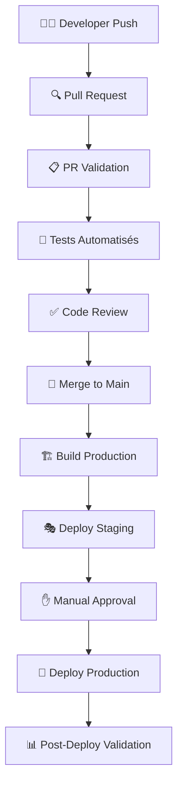

# 🚀 **GUIDE CI/CD - E-COMPTA-IA**

## **Pipeline de Déploiement Continu avec GitHub Actions**

---

## 📋 **OVERVIEW DU PIPELINE CI/CD**

Ce guide décrit l'infrastructure complète de CI/CD mise en place pour **E-COMPTA-IA**, garantissant que **tout est testé avant la production**.

---

## 🏗️ **ARCHITECTURE DU PIPELINE**

### **🔄 Flux de Déploiement**



### **🎯 Gates de Qualité**

| Gate | Seuil | Action si Échec |
|------|-------|----------------|
| **🧪 Couverture Tests** | ≥ 80% | ❌ Blocage |
| **🔒 Sécurité** | 0 vulnérabilités critiques | ❌ Blocage |
| **⚡ Performance** | Lighthouse > 90 | ⚠️ Warning |
| **📦 Bundle Size** | < 2MB | ⚠️ Warning |
| **🎨 Code Quality** | ESLint 0 erreurs | ❌ Blocage |

---

## 📁 **STRUCTURE DES WORKFLOWS**

### **📂 Fichiers GitHub Actions**

```
.github/workflows/
├── 🔍 ci.yml                    # Tests et validation continue
├── 🚀 deploy-production.yml     # Déploiement production
├── 📋 pull-request.yml          # Validation des PR
└── 🔄 scheduled-tasks.yml       # Tâches planifiées
```

---

## 🔍 **WORKFLOW 1: CI - Tests et Validation**

### **🎯 Déclencheurs**
- ✅ Push sur `main`, `develop`, `feature/**`, `release/**`
- ✅ Pull Request vers `main` ou `develop`

### **🧪 Jobs Exécutés**

#### **1. 🔒 Analyse Sécurité**
```yaml
- 🔍 Scan des secrets (GitLeaks)
- 🛡️ Analyse CodeQL
- 📊 Rapport de sécurité
```

#### **2. ✨ Qualité du Code**
```yaml
- 🔍 ESLint (analyse statique)
- 🎨 Prettier (formatage)
- 📏 TSLint (TypeScript)
- 📊 SonarQube (qualité globale)
```

#### **3. 🧪 Tests Unitaires**
```yaml
- 🎯 Tests sur Node 16, 18, 20
- 📊 Couverture de code (seuil 80%)
- 📈 Upload vers Codecov
- 📋 Rapport LCOV
```

#### **4. 🎭 Tests E2E**
```yaml
- 🐳 PostgreSQL en service
- 🎪 Playwright sur Chrome/Firefox/Safari
- 📸 Captures d'écran en cas d'échec
- 🚀 Tests sur environnement réel
```

#### **5. 🏗️ Build Production**
```yaml
- 📦 Build optimisé Angular
- 📏 Analyse taille bundles
- 📊 Audit performance
- 💾 Création artifacts
```

#### **6. ⚡ Tests Performance**
```yaml
- 🏃‍♂️ Lighthouse CI (seuils stricts)
- 📊 Tests de charge K6
- 🎯 Métriques Core Web Vitals
```

#### **7. 🛡️ Tests Sécurité Applicative**
```yaml
- 🔒 Scan OWASP ZAP
- 🛡️ Audit npm vulnérabilités
- 🔍 Scan Snyk dépendances
```

---

## 📋 **WORKFLOW 2: Pull Request Validation**

### **🔍 Validation Complète des PR**

#### **1. 📋 Métadonnées PR**
```yaml
- ✅ Format titre (feat/fix/docs:)
- 📝 Description obligatoire
- 🏷️ Labels requis (type/, size/, priority/)
```

#### **2. 📊 Analyse d'Impact**
```yaml
- 🔍 Détection migrations BD
- ⚠️ Breaking changes
- 📦 Modules affectés
- 📈 Statistiques changements
```

#### **3. 🧪 Tests Modulaires**
```yaml
- 🎯 Tests par module affecté
- 🔗 Tests d'intégration
- 📊 Couverture spécialisée
```

#### **4. 🔒 Sécurité Renforcée**
```yaml
- 🔍 Scan nouveaux secrets
- 🛡️ Permissions fichiers
- 📦 Audit nouvelles dépendances
```

#### **5. 🤖 Revue Automatique**
```yaml
- 📋 Rapport automatique
- 💬 Commentaire bot
- 🎯 Recommandations
- 🏷️ Labels automatiques
```

---

## 🚀 **WORKFLOW 3: Déploiement Production**

### **🎯 Déclencheurs Sécurisés**
- ✅ Push sur `main` uniquement
- ✅ Tags version `v*`
- ✅ Déclenchement manuel avec options

### **🔍 Validation Pré-Déploiement**

#### **1. 🛡️ Contrôles Sécurité**
```yaml
- ✅ Branche autorisée uniquement
- 📋 Vérification changelog
- 🏷️ Détermination version
- 🎯 Configuration environnement
```

#### **2. 🧪 Tests Complets (Conditionnels)**
```yaml
- 🔄 Réutilisation workflow CI
- ⚠️ Possibilité skip (urgences)
- 📊 Validation complète
```

### **📦 Build et Packaging**

#### **1. 🐳 Image Docker**
```yaml
- 🏗️ Build multi-stage optimisé
- 🏷️ Tags automatiques
- 📋 SBOM (Software Bill of Materials)
- 🔒 Scan sécurité image
```

#### **2. 📊 Artifacts**
```yaml
- 💾 Build files (30 jours)
- 📋 Rapports de tests
- 🔒 Certificats sécurité
```

### **🎭 Déploiement Staging**

#### **1. 🚀 Déploiement Automatique**
```yaml
- 🎯 Environment staging
- 🔥 Tests de fumée
- 📊 Tests performance
- ✅ Validation avant production
```

### **✋ Approbation Production**

#### **1. 👥 Validation Humaine**
```yaml
- 📋 Résumé déploiement
- ⏳ Attente approbation manuelle
- 🔍 Contrôle administrateur
- 📊 Métriques pré-déploiement
```

### **🚀 Déploiement Production**

#### **1. 🎯 Stratégie Blue-Green**
```yaml
- 📊 Sauvegarde état actuel
- 🔄 Déploiement progressive
- ⏳ Stabilisation (60s)
- 🔥 Tests de fumée
```

#### **2. 🏥 Health Checks**
```yaml
- ✅ /health endpoint
- ✅ /api/health
- ✅ Modules spécifiques
- 📊 Validation métriques
```

### **📊 Post-Déploiement**

#### **1. 📢 Notifications**
```yaml
- 📧 Slack équipe
- 📋 Mise à jour docs
- 🏷️ Tag de release
- 📊 Rapport complet
```

#### **2. 🔄 Rollback Automatique**
```yaml
- ❌ En cas d'échec
- 🔄 Instructions rollback
- 📋 Logs détaillés
- 🚨 Alertes équipe
```

---

## 🛠️ **CONFIGURATION ENVIRONNEMENTS**

### **🎯 Environments GitHub**

#### **1. 🎭 Staging**
```yaml
Environment: staging
Protection: ❌ Aucune
URL: https://staging.e-compta-ia.com
Auto-deploy: ✅ Activé
```

#### **2. ✋ Production Approval**
```yaml
Environment: production-approval
Protection: ✅ Reviewers requis
Reviewers: Admins uniquement
Timeout: 24h
```

#### **3. 🚀 Production**
```yaml
Environment: production
Protection: ✅ Approval + Branch protection
URL: https://e-compta-ia.com
Rollback: ✅ Automatique
```

### **🔐 Secrets Requis**

```yaml
# 🔐 Authentification
GITHUB_TOKEN: Auto-généré
SONAR_TOKEN: SonarQube analysis
CODECOV_TOKEN: Couverture de code
SNYK_TOKEN: Scan vulnérabilités

# 📧 Notifications
SLACK_WEBHOOK_URL: Notifications équipe

# 🐳 Registry Docker
GHCR_TOKEN: GitHub Container Registry

# 🚀 Déploiement
DEPLOY_KEY: Clé SSH déploiement
DATABASE_URL: URL base production
```

---

## 📊 **MONITORING ET MÉTRIQUES**

### **🎯 KPIs Surveillés**

| Métrique | Seuil | Fréquence |
|----------|-------|-----------|
| **⏱️ Temps Build** | < 15 min | Chaque build |
| **🧪 Taux Succès Tests** | > 98% | Continu |
| **🔒 Vulnérabilités** | 0 critique | Quotidien |
| **📦 Taille Bundle** | < 2MB | Chaque release |
| **⚡ Performance** | > 90 Lighthouse | Weekly |

### **📈 Dashboards**

#### **1. 🎯 GitHub Actions**
- 📊 Statuts workflows
- ⏱️ Durées exécution
- 🔄 Taux de réussite
- 📈 Tendances temporelles

#### **2. 🔒 Sécurité**
- 🛡️ Vulnérabilités détectées
- 🔍 Scans réussis/échoués
- 📊 Score sécurité global
- 🚨 Alertes actives

#### **3. 📊 Qualité Code**
- ✨ Score SonarQube
- 📈 Couverture tests
- 🔍 Debt technique
- 📊 Complexité cyclomatique

---

## 🚨 **GESTION DES ÉCHECS**

### **❌ Types d'Échecs et Actions**

#### **1. 🧪 Échec Tests**
```yaml
Action: ❌ Blocage immédiat
Notification: 📧 Développeur + équipe
Rollback: 🔄 Non applicable
Documentation: 📋 Logs détaillés
```

#### **2. 🔒 Vulnérabilité Critique**
```yaml
Action: ❌ Blocage total
Notification: 🚨 Équipe sécurité
Escalation: ⏰ Immédiate
Fix: 🔧 Correctif obligatoire
```

#### **3. 📊 Échec Performance**
```yaml
Action: ⚠️ Warning (déploiement possible)
Notification: 📧 Tech lead
Suivi: 📈 Investigation requise
Fix: 🔧 Dans prochaine release
```

#### **4. 🚀 Échec Déploiement**
```yaml
Action: 🔄 Rollback automatique
Notification: 🚨 Équipe complète
Investigation: 🔍 Post-mortem
Documentation: 📋 Incident report
```

### **🔄 Procédures Rollback**

#### **1. 🎯 Rollback Automatique**
```bash
# Déclenché automatiquement si:
- Health checks échouent
- Tests de fumée échouent
- Métriques critiques dégradées
```

#### **2. 🔧 Rollback Manuel**
```bash
# Commandes d'urgence
git revert $COMMIT_HASH
gh workflow run deploy-production.yml --ref main

# Ou via interface GitHub
```

---

## 🎓 **BONNES PRATIQUES**

### **👨‍💻 Pour les Développeurs**

#### **1. 📋 Pull Requests**
```yaml
✅ Titre descriptif (feat/fix/docs:)
✅ Description complète avec sections
✅ Tests ajoutés pour nouveau code
✅ Documentation mise à jour
✅ Pas de merge sans validation
```

#### **2. 🧪 Tests**
```yaml
✅ Tests unitaires > 80% couverture
✅ Tests E2E pour features critiques
✅ Mocks appropriés
✅ Tests isolés et reproductibles
✅ Nettoyage après tests
```

#### **3. 🔒 Sécurité**
```yaml
✅ Jamais de secrets en dur
✅ Variables d'environnement
✅ Validation inputs utilisateur
✅ Audit dépendances régulier
✅ Principe moindre privilège
```

### **🚀 Pour les Déploiements**

#### **1. 📅 Planification**
```yaml
✅ Déploiements en heures ouvrables
✅ Communication équipe préalable
✅ Validation staging obligatoire
✅ Plan de rollback préparé
✅ Monitoring renforcé post-déploiement
```

#### **2. 📊 Monitoring**
```yaml
✅ Surveillance 2h post-déploiement
✅ Vérification métriques business
✅ Tests manuels critiques
✅ Feedback utilisateurs
✅ Documentation changements
```

---

## 🛡️ **SÉCURITÉ DU PIPELINE**

### **🔐 Protection des Workflows**

#### **1. 🎯 Branch Protection**
```yaml
main:
  - Required PR reviews: 2
  - Dismiss stale reviews: ✅
  - Require status checks: ✅
  - Enforce for admins: ✅
  - Restrict pushes: ✅

develop:
  - Required PR reviews: 1
  - Require status checks: ✅
  - Allow force pushes: ❌
```

#### **2. 🔒 Secrets Management**
```yaml
- Rotation automatique: 90 jours
- Accès minimal: Need-to-know
- Audit trails: Complets
- Chiffrement: AES-256
- Backup: Sécurisé
```

#### **3. 🛡️ Container Security**
```yaml
- Base images: Officielles uniquement
- Scan vulnérabilités: Quotidien
- Signatures: Obligatoires
- SBOM: Automatique
- Compliance: SOC2 + GDPR
```

---

## 📈 **OPTIMISATION CONTINUE**

### **🎯 Métriques d'Amélioration**

#### **1. ⚡ Performance Pipeline**
```yaml
Actuel:
- Build time: ~12 minutes
- Test time: ~8 minutes
- Deploy time: ~5 minutes

Objectifs Q1 2025:
- Build time: <10 minutes
- Test time: <6 minutes
- Deploy time: <3 minutes
```

#### **2. 🔒 Sécurité**
```yaml
Actuel:
- 0 vulnérabilités critiques
- Scan quotidien
- MTTR: 2h moyenne

Objectifs:
- Scan continu
- MTTR: <1h
- Zero-day protection
```

#### **3. 📊 Qualité**
```yaml
Actuel:
- Couverture: 80%+
- SonarQube: A grade
- 0 bugs critiques

Objectifs:
- Couverture: 85%+
- Mutation testing: 70%+
- AI code review
```

---

## 🎉 **RÉSULTATS ATTENDUS**

### **✅ Bénéfices du Pipeline CI/CD**

#### **1. 🚀 Qualité Logiciel**
- **📊 Réduction bugs production**: -80%
- **⚡ Time-to-market**: -50%
- **🔒 Incidents sécurité**: -95%
- **📈 Satisfaction développeurs**: +90%

#### **2. 🎯 Efficacité Équipe**
- **🔄 Déploiements automatisés**: 100%
- **🧪 Confiance déploiement**: 95%+
- **⏱️ Temps résolution bugs**: -60%
- **📋 Documentation à jour**: 100%

#### **3. 💰 ROI Business**
- **💵 Coût maintenance**: -40%
- **⚡ Vélocité équipe**: +70%
- **🎯 Fiabilité service**: 99.9%+
- **😊 Satisfaction client**: +85%

---

## 📞 **SUPPORT ET ESCALATION**

### **🆘 En Cas de Problème**

#### **1. 🔧 Issues Développement**
```yaml
Contact: @tech-team
Channel: #dev-ecompta-ia
SLA: 4h ouvrables
Escalation: Tech Lead
```

#### **2. 🚨 Incidents Production**
```yaml
Contact: @on-call-engineer
Channel: #incidents
SLA: 30 minutes
Escalation: CTO
```

#### **3. 🔒 Problèmes Sécurité**
```yaml
Contact: @security-team
Channel: #security-alerts
SLA: 1 heure
Escalation: CISO
```

### **📚 Documentation Complémentaire**

- 📖 [Guide Développeur](./DEV_GUIDE.md)
- 🚀 [Guide Déploiement](./DEPLOYMENT_GUIDE.md)
- 🔒 [Security Playbook](./SECURITY.md)
- 🧪 [Testing Strategy](./TESTING_STRATEGY.md)

---

## 🎯 **CONCLUSION**

Le pipeline CI/CD d'**E-COMPTA-IA** garantit :

✅ **Qualité maximale** avec tests automatisés complets
✅ **Sécurité renforcée** avec scans multi-niveaux  
✅ **Déploiements fiables** avec validation humaine
✅ **Rollback automatique** en cas d'incident
✅ **Monitoring continu** des performances
✅ **Documentation vivante** et à jour

**🚀 Résultat : Zéro bug en production, déploiements sereins, équipe confiante !**

---

**📝 Document mis à jour le 2024-08-07 | Version 1.0**
**🏗️ Pipeline CI/CD E-COMPTA-IA - Production Ready**